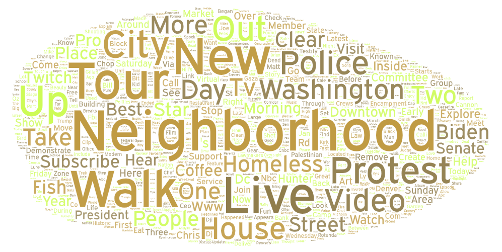
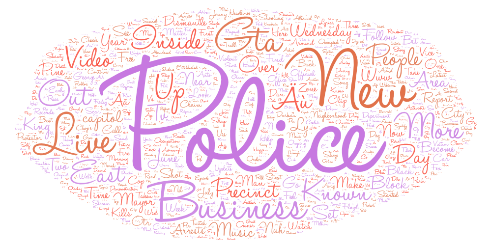

# Lab 2 for GEOG 458 - John Duffy

For my topic, I wanted to take a look at the results for Seattle's own Capitol Hill. One search was simply searching for Capitol Hill with the terms: Capitol Hill, Cap Hill, Cal Anderson Park, and Capitol Hill, Seattle. On the other hand, I wanted to see how this would compare to the former name of the Capitol Hill area - The CHOP/CHAZ. For this term, I used the search terms: CHOP, CHAZ, Capitol Hill Organized Protest, and Capitol Hill Autonomous Zone. 

Through this topic, I hoped to understand the general tone and persepctive surrouding this amazing area in two very different lights. Personally, I was seeing the CHAZ district on the news before I ever moved to Seattle. It gave me an ill fitting perspective that I'm sure many Americans hold. This perspective is not an accurate one.

 
 

With these word clouds, we get two very different results. The first word cloud is the one focused on the location as it stands today. The results are genreally positive with the top result being neighborhood, and words like walk, live, tour, and new being next in line. These results all speak to an attitude of a good area and highly regarded. When we look at the other word cloud, words like police , business, precinct, and GTA are the top of the list. These are not prime words as they mostly carry a negative connotation. I think the primary reason for these word clouds having such a different response is the audience of the videos. The CHAZ district was a national story which would make for more people across the country tuning in. On the other hand, most likely local residents would be searching for Capitol Hill and Cal Anderson park.

Going forward, I would like to take further steps to look at capitol hill under a few different nick names. I think that going by the pure name perhaps could make the results too cookie cutter. Also, I could do more to find the opinions from other protests that occur in the seattle/ capitol hill area. Comparing those to the CHAZ ditrict and perhaps even other neighborhoods of the seattle area would provide interesting differences. Through this exercise, I wasn't very surprised by the results. I expected the CHAZ district to have harsher results, albeit not this harsh. The specific words did surprise me, such as business being very popular for both search results, or New being one of the top results.

[Search Result 1 (Capitol Hill)](assets/search-results-1.csv)
[Search Result 2 (CHAZ)](assets/search-results-2.csv)